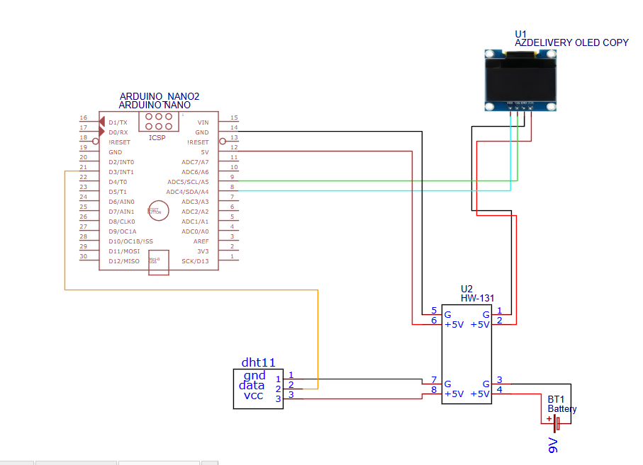

# 🌡️ Arduino Nano – Merjenje temperature in vlage

## 📖 Opis delovanja

Projekt meri temperaturo in relativno vlago z uporabo senzorja DHT11.
Podatki se prikazujejo na OLED zaslonu v realnem času.
Za stabilnost je uporabljeno povprečenje (smoothing).

---

## ⚙️ Kosovnica

* Arduino Nano
* DHT11 senzor
* OLED SSD1306 (I2C)
* povezovalne žice

---

## 🔌 Vezava

### Povezave:

* VCC → 5V
* GND → GND
* SDA → A4
* SCL → A5
* DATA → D2

---

## 💻 Program

Koda:
---
code/temp_vlaga_oled_dht.ino
---

## 📊 Natančnost
DHT11 ima približno:
* ±2°C
* ±5% vlage
---

## 🔧 Izboljšave
* boljši senzor (DHT22)
* graf meritev
* kalibracija

