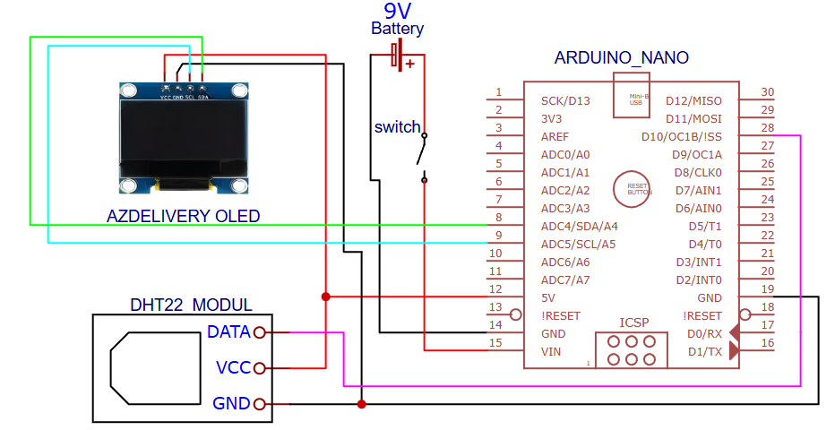

# 🌡️ Merjenje temperature in vlage

---

## 📖 1. Opis delovanja

Projekt meri temperaturo in relativno vlago z uporabo senzorja DHT22.  
Podatki se v realnem času prikazujejo na OLED zaslonu SSD1306.  
Za bolj stabilne rezultate se uporablja povprečenje meritev (smoothing).

---

## ⚙️ 2. Kosovnica (BOM)

- Arduino nano
- DHT22 senzor
- OLED SSD1306 (I2C)
- povezovalne žice
- 9V baterija

---

## 🔌 3. Vezava (shema)



---

## 🧱 4. Načrt ohišja

### Ohišje


### Pokrov


---

## 📐 5. Izračuni

Pri projektu niso potrebni kompleksni izračuni.  
Uporabljen je digitalni senzor, ki podatke podaja neposredno.

---

## 💻 6. Program

Koda se nahaja v:

```text
code/temp_vlaga_oled_dht.ino
```

## 🎥 7. Video delovanja

Video delovanja projekta:

---

## 📄 8. Poročilo (A-test)

(dodaj PDF datoteko v GitHub repozitorij)

---

## 📊 9. Natančnost in komentar

Senzor DHT22 ima:

- ±2.0 °C natančnost temperature
- ±1 % natančnost vlage

Meritve so bolj stabilne in natančne kot pri senzorji DHT11, lahko pa še vedno rahlo nihajo zaradi okolja ali postavitve.

---

## 🔧 10. Izboljšave

- dodajanje kalibracije
- prikaz grafa meritev
- shranjevanje podatkov
- povezava z Wi-Fi ali Bluetooth
- spletni prikaz podatkov

---

## 🧠 Zaključek

Projekt uspešno prikazuje temperaturo in vlago v realnem času.  
Primeren je za učenje dela s senzorji in prikazovalniki.
