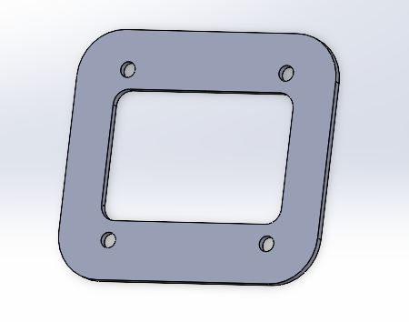

# 🌡️ Merjenje temperature in vlage

---

## 📖 1. Opis delovanja

Projekt meri temperaturo in relativno vlago z uporabo senzorja DHT22.  
Podatki se v realnem času prikazujejo na OLED zaslonu SSD1306.  
Za bolj stabilne rezultate se uporablja povprečenje meritev (smoothing).

---
⚙️ 2. Kosovnica (BOM)
uporabila sva:
- Arduino Nano
- DHT22 senzor temperature in vlage
- OLED SSD1306 zaslon (I2C)
- povezovalne žice
- univerzalna perforirana ploščica (perfboard)
- stikalo ON/OFF
- držalo za 4x AA baterije
- 4x AA baterije
- 3D tiskano ohišje
- vijaki in matice M3

---

## 🔌 3. Vezava (shema)


---

## 🧱 4. Načrt ohišja

### Ohišje


### Pokrov


### okvir


---

## 📐 5. Izračuni

Pri projektu niso potrebni kompleksni izračuni.  
Uporabljen je digitalni senzor, ki podatke podaja neposredno.

---

## 💻 6. Program

Koda se nahaja v:

```text
code/temp_vlaga_oled_dht.ino
```

## 🎥 7. Video delovanja

Video delovanja projekta:

---

## 📄 8. Poročilo (A-test)
Test vlage:


Test temperature:


---

📊 9. Natančnost in komentar

Senzor DHT22 ima:
± 1,0 °C natančnost temperature
± 5 % natančnost relativne vlage

Po vklopu naprave senzor potrebuje nekaj sekund za stabilizacijo meritev. V tem času se lahko prikazane vrednosti nekoliko razlikujejo od dejanskih. Ko se senzor stabilizira, prikazuje pravilne in zanesljive meritve.

Meritve so dovolj natančne za spremljanje temperature in vlage v prostoru, vendar lahko zaradi sprememb okolja, gibanja zraka ali lastnosti senzorja rahlo nihajo.

---

## 🔧 10. Izboljšave

- dodajanje kalibracije
- prikaz grafa meritev
- shranjevanje podatkov
- povezava z Wi-Fi ali Bluetooth
- spletni prikaz podatkov

---
🧠 Zaključek
Težave in rešitve

Med izdelavo merilnika temperature in vlage sva naletela na več težav. Največ težav je povzročalo napajanje naprave. Sprva sva uporabljala 9 V baterijo, vendar OLED zaslon ni deloval pravilno. Arduino Nano se je sicer vklopil, zaslon pa je ostal ugasnjen ali pa je deloval nezanesljivo. Po preverjanju vezave sva ugotovila, da 9 V baterija ni zagotavljala dovolj stabilnega napajanja za celoten sistem. Težavo sva rešila z uporabo držala za štiri AA baterije, ki je zagotavljalo bolj stabilno napetost.

Pojavile so se tudi težave pri povezovanju komponent. Večkrat sva preverjala pravilnost povezav med Arduino Nano, OLED zaslonom in DHT22 senzorjem. Zaradi velikega števila povezav je prišlo do nekaj napačnih priklopov, ki sva jih odpravila s pregledom vezave in primerjavo s shemo.

Pri testiranju je prišlo tudi do okvare enega Arduino Nano modula. Zaradi napačne vezave oziroma kratkega stika se je mikrokontroler začel pregrevati. Težavo sva rešila z zamenjavo modula in dodatnim preverjanjem povezav pred vsakim novim preizkusom.

Težave so se pojavljale tudi pri branju podatkov z DHT22 senzorja. Občasno se je na zaslonu izpisalo sporočilo »Error«, ker senzor ni vrnil veljavne meritve. Po preverjanju kode in povezav sva ugotovila, da gre za običajno lastnost senzorja, saj občasno ne uspe pravilno prebrati podatkov. Naprava po naslednji meritvi ponovno normalno deluje.

Po vklopu naprave je bilo potrebno počakati nekaj sekund, da se je senzor stabiliziral in začel prikazovati pravilne meritve temperature in vlage.

Veliko časa sva namenila tudi izdelavi in prilagajanju 3D-tiskanega ohišja. Potrebno je bilo večkrat prilagoditi dimenzije odprtin za zaslon, senzor, stikalo in baterijsko držalo, da so se vsi deli pravilno prilegali.

Kljub težavam sva napravo uspešno dokončala. Projekt nama je omogočil pridobitev novih znanj s področja programiranja Arduino naprav, povezovanja elektronskih komponent, odpravljanja napak ter 3D-modeliranja in 3D-tiskanja. Končni izdelek zanesljivo meri temperaturo in relativno vlago ter rezultate prikazuje na OLED zaslonu v realnem času.
