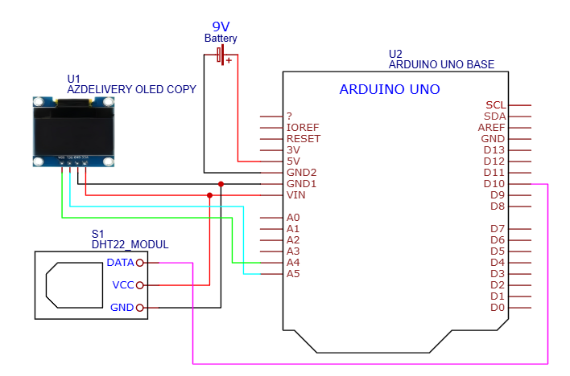

# 🌡️Merjenje temperature in vlage

## 📖 1. Opis delovanja

Projekt meri temperaturo in relativno vlago z uporabo senzorja DHT22.
Podatki se v realnem času prikazujejo na OLED zaslonu (SSD1306).
Za bolj stabilne rezultate se uporablja povprečenje (smoothing).

---

## ⚙️ 2. Kosovnica (BOM)

* Arduino uno
* DHT22 senzor
* OLED SSD1306 (I2C)
* povezovalne žice
* 9V baterija

---

## 🔌 3. Vezava (shema)



---

## 🧱 4. Načrt ohišja


---

## 📐 5. Izračuni
Pri projektu niso potrebni kompleksni izračuni.
Uporabljen je digitalni senzor, ki podatke podaja neposredno.

---
## 💻 6. Program
Koda se nahaja v:
```
code/temp_vlaga_oled_dht.ino
```

---

## 🎥 7. Video delovanja

(dodaj YouTube link)

---

## 📄 8. Poročilo (A-test)
(dodaj PDF datoteko v repo)

---
📊 9. Natančnost in komentar

Senzor DHT22 ima:

• ±0.5°C natančnost temperature  
• ±2% natančnost vlage  

Meritve so bolj stabilne in natančne kot pri DHT11, lahko pa še vedno rahlo nihajo zaradi okolja.
---
🔧 10. Izboljšave

• dodajanje kalibracije  
• prikaz grafa meritev  
• shranjevanje podatkov  
• povezava z Wi-Fi ali Bluetooth  
• spletni prikaz podatkov
---

## 🧠 Zaključek

Projekt uspešno prikazuje temperaturo in vlago v realnem času.
Primeren je za učenje dela s senzorji in prikazovalniki.
---


